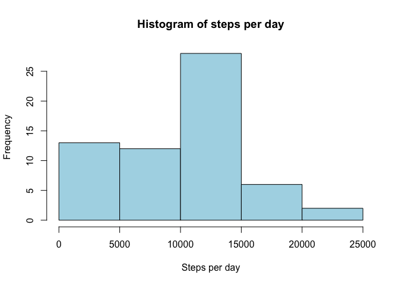
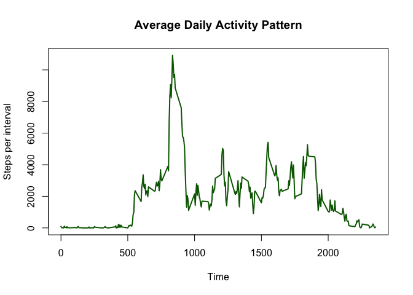
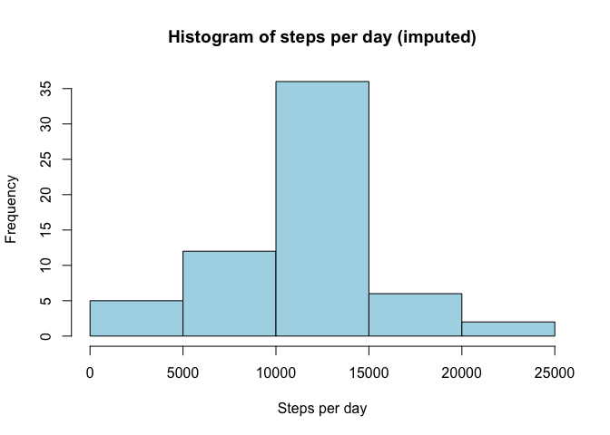
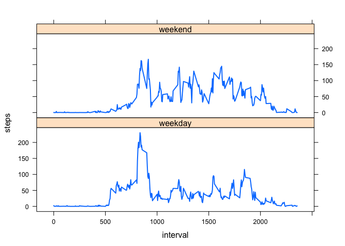

# Reproducible Research: Peer Assessment 1


## Loading and preprocessing the data

```r
library(dplyr)
```

```
## 
## Attaching package: 'dplyr'
## 
## The following objects are masked from 'package:stats':
## 
##     filter, lag
## 
## The following objects are masked from 'package:base':
## 
##     intersect, setdiff, setequal, union
```

```r
library(lubridate)
```


```r
activity <- read.csv(unz("/Users/ashlinn/GitHub/RepData_PeerAssessment1/activity.zip",filename = "activity.csv"))
steps_per_day <- activity %.% group_by(date) %.% summarise(sum(steps, na.rm = TRUE))
names(steps_per_day) <- c("date", "steps")
steps_per_interval <- activity %.% group_by(interval) %.% summarise(sum(steps, na.rm = TRUE))
names(steps_per_interval) <- c("interval", "steps")
```


## What is mean total number of steps taken per day?

```r
hist(steps_per_day$steps, main = "Histogram of steps per day", xlab = "Steps per day", col = "lightblue")
```

 

```r
mean_original <- round(mean(steps_per_day$steps))
median_original <- median(steps_per_day$steps)
```

The mean steps per day is 9354. The median steps per day is 10395.

## What is the average daily activity pattern?

```r
plot(steps_per_interval$interval, steps_per_interval$steps, type = "l", lwd = 2, col = "darkgreen", main = "Average Daily Activity Pattern", ylab = "Steps per interval", xlab = "Time")
```

 

```r
most_steps <- steps_per_interval$interval[steps_per_interval$steps ==max(steps_per_interval$steps, na.rm = TRUE)]
```

The 5-minute period in which the most steps were taken was 835.

## Imputing missing values

```r
NAPerVariable <- function(x) {
  D1 <- is.na(x)
  colSums(D1)
}
NAPerVariable(activity)
```

```
##    steps     date interval 
##     2304        0        0
```

We will impute missing data using the mean steps for each interval:


```r
activity_imputed <- activity

for (i in 1:length(unique(activity_imputed$interval))) {
  activity_imputed$steps[is.na(activity_imputed$steps & activity_imputed$interval == activity_imputed$interval[i])] <- mean(activity_imputed$steps[activity_imputed$interval == activity_imputed$interval[i]], na.rm  = TRUE)
  }

steps_per_day_imputed <- activity_imputed %.% group_by(date) %.% summarise(sum(steps, na.rm = TRUE))
names(steps_per_day_imputed) <- c("date", "steps")

hist(steps_per_day_imputed$steps, main = "Histogram of steps per day (imputed)", xlab = "Steps per day", col = "lightblue")
```

 

```r
mean_imputed <- round(mean(steps_per_day_imputed$steps))
median_imputed <- round(median(steps_per_day_imputed$steps))

mean_difference <- mean_imputed - mean_original
median_difference <- median_imputed - median_original
```

The mean using the imputed data is 1.0766\times 10^{4}. The median using the imputed data is 1.0766\times 10^{4}. 

The difference in the means between the imputed and original data sets is 1412 steps. 
The difference in the medians between the imputed and original data sets is 371 steps. 


## Are there differences in activity patterns between weekdays and weekends?


```r
activity_imputed$date <- ymd(activity_imputed$date)
activity_imputed$dow <- ifelse(weekdays(activity_imputed$date) %in% c("Monday", "Tuesday", "Wednesday", "Thursday", "Friday"), "weekday", "weekend")
activity_imputed$dow <- factor(activity_imputed$dow)


library(lattice)
activity_imputed_perinterval <- activity_imputed %.% group_by("interval", "dow") %.% summarise(mean(steps))
names(activity_imputed_perinterval) <- c("interval", "dow", "steps")
xyplot(steps~interval|dow, data = activity_imputed_perinterval, type = "l", lwd = 2, layout = c(1,2))
```

 

It seems that weekdays have more activity in the morning hours versus the rest of the day on average, while on weekend days the activity is spread more evenly throughout the daytime hours.
